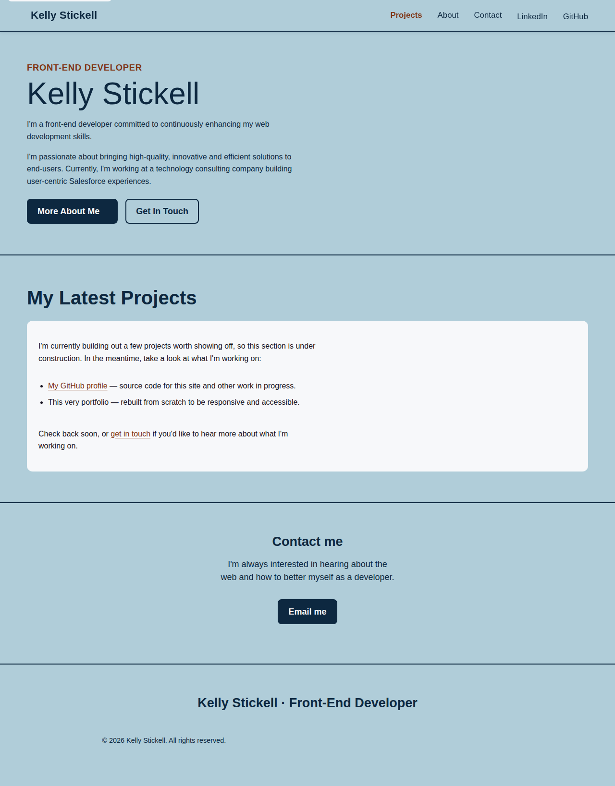
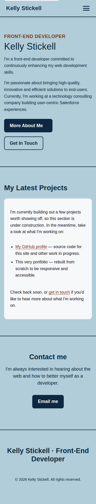

# My Portfolio Website

This repository serves as the home for my portfolio website, a platform where I proudly display a collection of projects that represent my journey in front-end development. As I continue to refine my skills, this site acts as a living showcase of my progress and the evolution of my work. Be sure to stay tuned for ongoing updates and enhancements, mirroring the same dedication I put into my projects. Explore and enjoy!

## Badges:
Version 2 &mdash; responsive, accessible redesign

## Running locally
This is a static site with no build step. Clone the repo and open `index.html` in a browser, or serve it locally:

```
python3 -m http.server 8000
```

Then visit `http://localhost:8000`.

## Screenshots:
The desktop mode for my website.


A glimpse at the mobile mode for my website.


## Support:
Email me at kelly.stickell@gmail.com. I'm always open to suggestions for how to improve my code, resolve a defect, or general feedback!

## Acknowledgments:
Changelog:
Version 1 - September 2023 - Initial Website Commit
Version 2 - 2026 - Responsive layout fixes, WCAG-focused accessibility pass (semantic landmarks, keyboard-accessible nav, focus states, color contrast, alt text), and a rebuilt Projects section.

## Features:
- Fully responsive layout (phone through desktop)
- Accessible navigation: keyboard-operable menu toggle, skip-to-content link, visible focus states
- WCAG AA color contrast throughout
- Semantic HTML with proper heading structure and landmarks

## License:
TBD

## FAQ or Troubleshooting:
TBD

## Contact Information:
TBD

## Roadmap:
TBD

## Code of Conduct:
TBD
